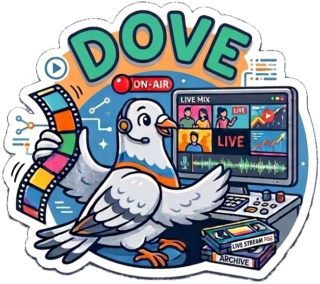

# DOVE — Dove Online Video Editor



A live video mixing application with a web-based interface. Mix inputs into scenes, cut scenes to program, and stream the output to one or more destinations.

Developed by and for [DORFTV](https://dorftv.at). Inspired by [bbc/brave](https://github.com/bbc/brave).

## Concept

```
Inputs → Scenes → Program → Outputs
```

**Inputs** — media sources: local files, network streams, web pages, yt-dlp URLs, test patterns.

**Scenes** — compositor layouts combining multiple inputs. Each scene has slots with per-slot position, size, alpha, and volume controls.

**Program** — the currently live scene, sent to all active outputs simultaneously.

**Outputs** — streaming destinations (SRT, RTMP, HLS, WebRTC, Decklink, etc.). Multiple outputs can share an encoder; dedicated encoders per output are also possible.

## Features

### Inputs

| Type | Description |
|------|-------------|
| `uridecodebin3` | Local files and streams (HTTP, SRT, RTMP, RTSP) |
| `playlist` | Sequence of video clips and HTML pages |
| `wpesrc` | Web page rendered as video (HTML/CSS/JS overlays) |
| `ytdlp` | YouTube, Twitch, and hundreds of other sites via yt-dlp |
| `nodecg` | NodeCG broadcast graphics |
| `testsrc` | SMPTE color bars and test patterns |

### Outputs

| Type | Description |
|------|-------------|
| `srtsink` | SRT push to a remote listener |
| `srtserversink` | SRT server mode (remotes connect to DOVE) |
| `rtmpsink` | RTMP push |
| `rtspclientsink` | RTSP push |
| `hlssink2` | HLS segments (also used for previews) |
| `decklink` | SDI/HDMI via Blackmagic Design card |
| `shout2send` | Icecast/Shoutcast audio stream |
| `whipclientsink` | WebRTC WHIP push |

### Encoders

Hardware-accelerated encoding via VAAPI (AMD/Intel) or Vulkan. Software fallback via x264/x265. Set `video_encoder.name = "auto"` to pick the best available encoder at startup.

| Encoder | Type |
|---------|------|
| `x264` | Software (always available) |
| `openh264` | Software alternative |
| `vah264enc` / `vaapih264enc` | VAAPI (AMD/Intel) |
| `vulkanh264enc` | Vulkan (GStreamer 1.28+ / Alpine image only) |
| `mpph264enc` | Rockchip hardware |

### Previews

- **WebRTC** — sub-second latency preview in the browser
- **HLS** — works in restricted networks, through any reverse proxy over HTTPS

## Quick Start

### Docker Compose

```bash
git clone https://github.com/dorftv/dove.git && cd dove
cp config-example.toml config.toml
```

**Software rendering (no GPU):**
```bash
docker compose up
```

**AMD GPU (VAAPI + Vulkan RADV):**
```bash
docker compose -f docker-compose.yml -f docker-compose.amd.yml up
```

**Intel GPU (VAAPI + Vulkan ANV):**
```bash
docker compose -f docker-compose.yml -f docker-compose.intel.yml up
```

Open [http://localhost:5000](http://localhost:5000)

### Configuration

Copy `config-example.toml` to `config.toml` and edit as needed. Key sections:

```toml
[main]
width = 1920
height = 1080
framerate = 25

[video_encoder]
name = "auto"   # auto, x264, vah264enc, vulkanh264enc, …
```

## Tech Stack

- **GStreamer 1.26+** — single unified pipeline (no gst-interpipe)
- **FastAPI + uvicorn** — REST API and WebSocket
- **Nuxt 4** — web frontend
- **Python 3.12+**
- **yt-dlp** — stream URL extraction

## Authentication

Optional OIDC authentication (Keycloak, Authentik, Authelia, etc.). Disabled by default — enable with:

```toml
[auth]
enabled = true
issuer = "https://auth.example.com/realms/dove"
client_id = "dove-app"
client_secret = "your-secret"
```

Four roles: User, Supervisor, Outputs, Admin. See [`docs/auth.md`](docs/auth.md) for setup, role details, API tokens, and nginx integration.

## Documentation

Docs are in the [`docs/`](docs/) directory. In-app help is also available at `/help` after starting DOVE.

## Development

**Backend:**
```bash
cd dove
poetry install
python main.py --config config.toml
```

**Frontend:**
```bash
cd dove-frontend
npm install
npm run dev   # http://localhost:3000
```

**GStreamer debug:**
```bash
GST_DEBUG=2 GST_DEBUG_DUMP_DOT_DIR=/tmp python main.py --config config.toml
```

## Notes

- `wpesrc` requires `--cap-add SYS_ADMIN` and `--security-opt apparmor=unconfined` (handled by the provided compose files)
- Decklink requires a supported Blackmagic Design card and the `decklink` GStreamer plugin
- WebRTC previews use `announced_ip` for the server's public IP — set in `config.toml` or via `ANNOUNCED_IP` env var
