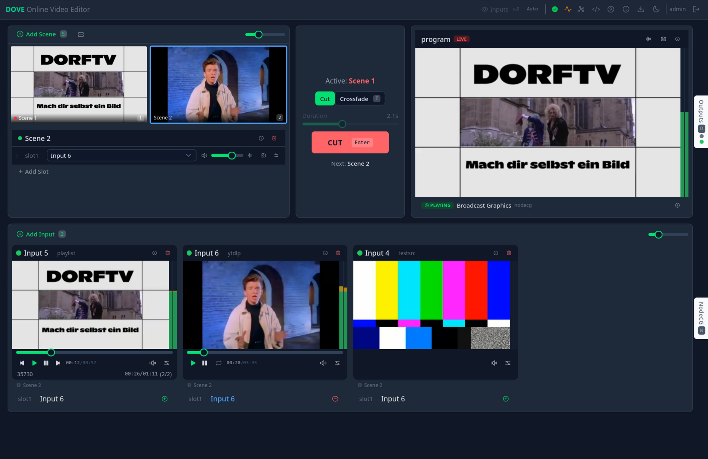
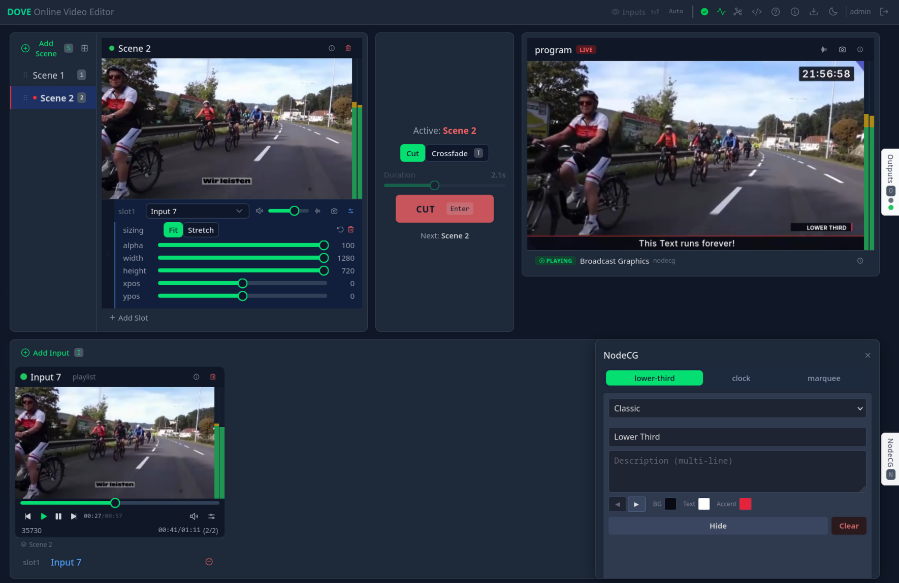

# DOVE — Online Video Editor

<table>
  <tr>
    <td width="35%" valign="middle">
      
    </td>
    <td width="65%" valign="middle">
      DOVE is an API driven Video/Audio Editor for live mixing with an intuitive web based Interface.
      <br><br>
      Developed by and for <a href="https://dorftv.at">DORFTV</a>. Inspired by <a href="https://github.com/bbc/brave">bbc/brave</a>.
    </td>
  </tr>
</table>

[](LICENSE)
[](https://www.python.org/downloads/)
[](https://gstreamer.freedesktop.org/)
[](https://nuxt.com/)
[](https://fastapi.tiangolo.com/)

<table>
  <tr>
    <td width="50%"></td>
    <td width="50%"></td>
  </tr>
</table>

## Concept

```
Inputs → Scenes → Program → Outputs
```

**Inputs** — media sources: local files, network streams, web pages, yt-dlp URLs, cameras, test patterns.

**Scenes** — compositor layouts combining multiple inputs. Each scene has slots with per-slot position, size, z-order, alpha, and volume controls.

**Program** — the currently live scene, sent to all active outputs simultaneously. Cut or crossfade between scenes.

**Outputs** — streaming destinations (SRT, RTMP, HLS, WebRTC, Decklink, etc.). Multiple outputs can share an encoder; dedicated encoders per output are also possible.

## Features

### Inputs

| Type | Description |
|------|-------------|
| `uridecodebin3` | Local files and streams (HTTP, SRT, RTMP, RTSP) |
| `playlist` | Sequence of video clips and HTML pages |
| `wpesrc` | Web page rendered as video (HTML/CSS/JS overlays) |
| `ytdlp` | YouTube, Twitch, and hundreds of other sites via yt-dlp |
| `nodecg` | NodeCG broadcast graphics |
| `v4l2src` | Webcams and capture cards (V4L2) |
| `imagesrc` | Still images (PNG, JPEG, WebP, SVG) |
| `testsrc` | SMPTE color bars and test patterns |
| `whip` | Browser screen share or webcam via WebRTC (experimental) |

### Outputs

| Type | Description |
|------|-------------|
| `srtsink` | SRT push to a remote listener |
| `srtserversink` | SRT server mode (remotes connect to DOVE) |
| `rtmpsink` | RTMP push |
| `rtspclientsink` | RTSP push |
| `hlssink2` | HLS segments (also used for previews) |
| `splitmuxsink` | Segmented file recording |
| `decklink` | SDI/HDMI via Blackmagic Design card |
| `shout2send` | Icecast/Shoutcast audio stream |

### Encoders

Hardware-accelerated encoding via VAAPI (AMD/Intel) or Vulkan. Software fallback via x264/x265. Set `video_encoder.name = "auto"` to pick the best available encoder at startup. Multiple outputs can share a single encoder, or each output can have its own dedicated encoder.

| Encoder | Type |
|---------|------|
| `x264` | Software (always available) |
| `openh264` | Software alternative |
| `vah264enc` / `vaapih264enc` | VAAPI (AMD/Intel) |
| `vulkanh264enc` | Vulkan (Mesa 26+, GStreamer 1.28+) |
| `mpph264enc` | Rockchip hardware |

### Audio & Video Filters

Per-input dynamic filter chains, applied at runtime without pipeline restart.

**Audio:** highpass, lowpass, 3-band/10-band EQ, compressor (LSP), expander (LSP), gate (LSP), limiter, amplify, pan, invert, echo, denoise, loudnorm. See [`dove/docs/audio-filters.md`](dove/docs/audio-filters.md).

**Video:** color balance, flip/mirror, crop, color effects, blur, chroma key. **Experimental (requires `frei0r-plugins`):** pixelate, cartoon, glow, vignette, film grain, glitch, scanlines, sobel edge, color halftone. See [`dove/docs/video-filters.md`](dove/docs/video-filters.md).

### Previews

- **WebRTC** — sub-second latency preview in the browser.
- **HLS** — works in restricted networks, through any reverse proxy over HTTPS.

### Keyboard Shortcuts

Full keyboard control for live production: scene selection (1–9), cut/crossfade (Enter), transition toggle (T), and more. Press `?` in the UI for the full list. See [`dove/docs/keyboard-shortcuts.md`](dove/docs/keyboard-shortcuts.md).

## Quick Start

**Want a ready-to-run setup with example inputs and scenes?** See [dove-demo](https://github.com/dorftv/dove-demo) for a pre-configured docker-compose stack you can spin up in one command.

To install DOVE from scratch:

### Docker Compose

```bash
git clone https://github.com/dorftv/dove.git && cd dove
cp config-example.toml config.toml
```

**Software rendering (no GPU):**
```bash
docker compose up
```

**AMD GPU (VAAPI + Vulkan):**
```bash
docker compose -f docker-compose.yml -f docker-compose.amd.yml up
```

**Intel GPU (VAAPI + Vulkan):**
```bash
docker compose -f docker-compose.yml -f docker-compose.intel.yml up
```

Open [http://localhost:5000](http://localhost:5000)

### Configuration

Copy `config-example.toml` to `config.toml` and edit as needed. See [`dove/docs/config.md`](dove/docs/config.md) for all options.

```toml
[main]
default_resolution = "HD720"    # QHD, FullHD, HD720, nHD, …
default_framerate = "30/1"
volume = 0.7

[preview.scenes]
type = ["webrtcbin", "hlssink2"]
video_encoder.name = "auto"
```

## Authentication

Optional OIDC authentication (Keycloak, Authentik, Authelia, etc.). Disabled by default — enable with:

```toml
[auth]
enabled = true
issuer = "https://auth.example.com/realms/dove"
client_id = "dove-app"
client_secret = "your-secret"
```

Four roles: User, Supervisor, Outputs, Admin. See [`dove/docs/auth.md`](dove/docs/auth.md) for setup, role details, API tokens, and nginx integration.

## Documentation

In-app help is available at `/help` after starting DOVE. All docs are in the [`dove/docs/`](dove/docs/) directory:

**Setup** — [Interface overview](dove/docs/interface.md) · [Configuration](dove/docs/config.md) · [Authentication](dove/docs/auth.md)

**Pipeline** — [Inputs](dove/docs/inputs.md) ([uridecodebin3](dove/docs/inputs-uridecodebin3.md) · [playlist](dove/docs/inputs-playlist.md) · [wpesrc](dove/docs/inputs-wpesrc.md) · [ytdlp](dove/docs/inputs-ytdlp.md) · [nodecg](dove/docs/inputs-nodecg.md) · [testsrc](dove/docs/inputs-testsrc.md)) · [Scenes](dove/docs/scenes.md) · [Outputs](dove/docs/outputs.md) · [Encoders](dove/docs/encoders.md)

**Effects & Output** — [Audio filters](dove/docs/audio-filters.md) · [Video filters](dove/docs/video-filters.md) · [Previews](dove/docs/previews.md)

**Operations** — [Debugging](dove/docs/debugging.md)

## Tech Stack

- **GStreamer 1.26+**
- **FastAPI + uvicorn** — REST API and WebSocket
- **Nuxt 4** — web frontend
- **Python 3.12+**

## Development

Running DOVE natively from a Python venv: see [`dove/docs/install.md`](dove/docs/install.md).

## Contributing

Contributions are welcome! Please open an issue first to discuss larger changes. For bug reports, include the GStreamer version, config, and relevant logs.

## Notes

- Decklink requires a supported Blackmagic Design card and the `decklink` GStreamer plugin
- WebRTC previews use `announced_ip` for the server's public IP — set in `config.toml` or via `ANNOUNCED_IP` env var

## License

[GNU Affero General Public License v3.0](LICENSE)
